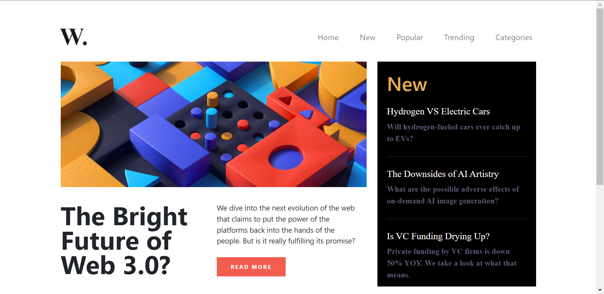

# **DOM Assignment 8**

## **Task 1**

The user have to show **"scroll bar"** in the aside section.

### **After Update**


### **Project Solution**
````javascript
  const container = document.querySelector(".new");

  container.style.maxHeight = "450px";
  container.style.overflowY = "scroll";
````

## **Task 2**

The user have to remove background image.

### **After Update**


### **Project Solution**
````javascript
 document.body.style.backgroundImage = "none";
````

## **Task 3**

The user have to show toggler button and when we click on toggler then our navbar menu will open under the toggler button.

### **After Update**


### **Project Solution**
````javascript
const toggler = document.querySelector(".navbar-toggler");
toggler.setAttribute("data-bs-target", "#navbarTogglerDemo01");
toggler.setAttribute("data-bs-toggle", "collapse");
````